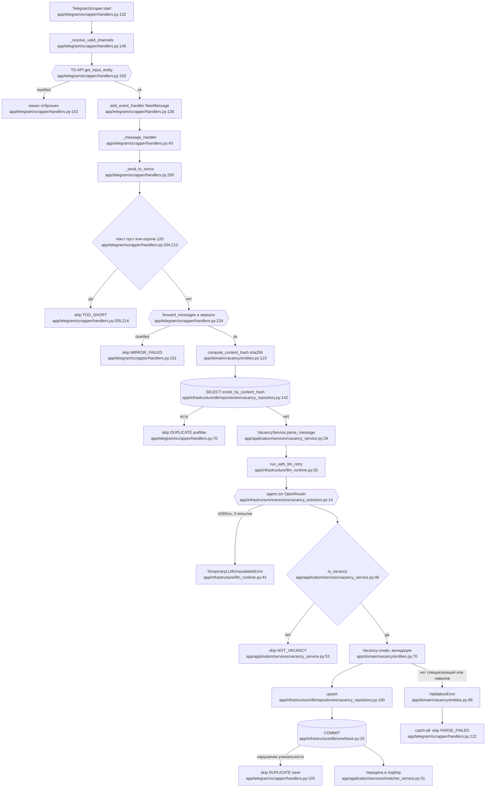

# F1 — Приём вакансий

Вход: `app/telegram/scrapper/handlers.py:43` (`_message_handler`), запуск
слушателя в `:132`. Терминал: строка в `vacancies` и передача в подбор.

## Порядок операций

Зеркалирование идёт **до** разбора, а не после: сначала сообщение
пересылается в mirror-канал (`handlers.py:224`), и только потом считается хеш
и вызывается модель. Это осознанно — рассылка потом делает `copy_message` из
зеркала, а не из исходного канала.

Дедупликация двойная: оптимистичная проверка по `content_hash`
(`vacancy_repository.py:142`) и защита уникальным индексом, чей `IntegrityError`
ловится в `handlers.py:102` с пометкой `source="save"` против `"prefilter"`.
Это настоящая защита от гонки, а не перестраховка.

## Схема

## Две дыры в наблюдаемости

**`SkipReason.NO_SKILLS` объявлена, но не вызывается нигде** — ноль call sites
во всём `app/`. Вакансия без специализации или навыков падает с
`ValidationError` (`entities.py:99`), ловится общим обработчиком
(`handlers.py:119`) и считается как **`parse_failed`**. То есть потеря видна в
метриках, но под чужим именем, и отделить её от настоящих сбоев разбора нельзя.

**`TemporaryLLMUnavailableError` не увеличивает ни один счётчик пропусков**
(`handlers.py:111-118` только логирует). Недоступность модели видна лишь в
`LLM_ERRORS_TOTAL`, но не в воронке «почему сообщение не стало вакансией».

## Побочные эффекты

Telegram: `get_input_entity` при старте, `forward_messages` на каждое
сообщение. LLM: один вызов на сообщение-кандидат, до трёх попыток с
экспоненциальной паузой (`llm_runtime.py:11,24,58`). База: два SELECT по хешу,
INSERT либо UPDATE, COMMIT.

## Внешние зависимости

Подбор — `matcher_service.py:31`. Общий рантайм LLM — `llm_runtime.py:20`,
тот же, что у разбора резюме (`llm.py:132,221`). Наблюдаемость —
`observability/service.py:23`, счётчики через `counter_store.py:32`.
Конфигурация каналов — `config.py:130`, `channels_map.json`.

## Пробелы разведки

Не проверен уникальный индекс на `content_hash` в моделях и миграциях —
существование выведено из наличия обработчика `IntegrityError`.
Не установлено, при каком условии выбирается `NoOpObservabilityService`
(`service.py:52`) — при нём все счётчики этой фичи молчат.
