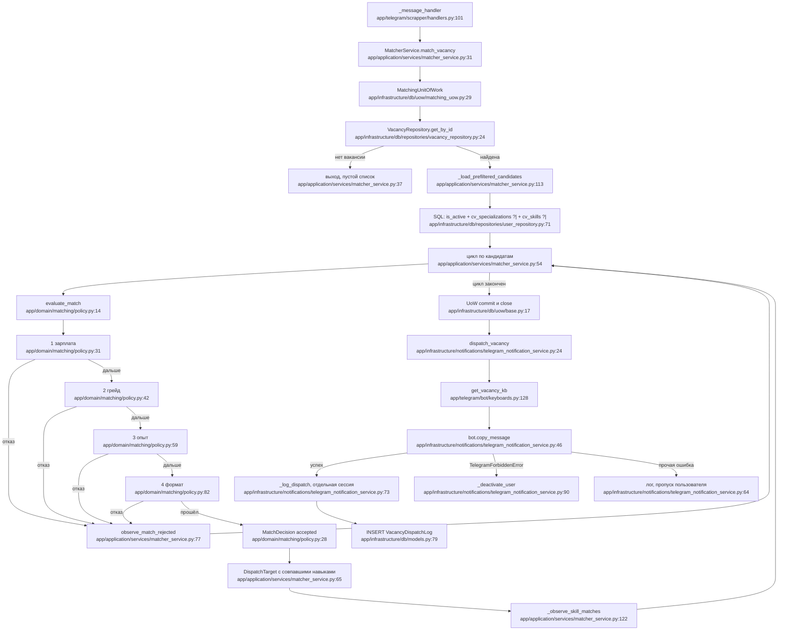

# F2 — Подбор и рассылка вакансий

Вход: `app/application/services/matcher_service.py:31` (вызов из
`app/telegram/scrapper/handlers.py:101`).
Терминал: сообщение в чате пользователя + строка `vacancy_dispatch_log`.

## Порядок отказов в политике

`evaluate_match` (`app/domain/matching/policy.py:14-28`) — лестница с коротким
замыканием: побеждает первый сработавший предикат, его причина и попадает в
счётчик.

| # | Проверка | Строки | Что делает с «не указано» |
|---|---|---|---|
| 1 | зарплата | `policy.py:31-39` | режим не STRICT, зарплата пользователя или вакансии не задана → пропускает |
| 2 | грейд | `policy.py:42-56` | `IGNORE`, грейд не задан, `Grade.UNDEFINED` у вакансии → пропускает |
| 3 | опыт | `policy.py:59-79` | структурно идентична грейду |
| 4 | формат | `policy.py:82-91` | пустой набор форматов или `WorkFormat.UNDEFINED` → пропускает |

Правило единое: **любое «не указано» с любой стороны — разрешительное**.

Следствие ordering'а: кандидат, не прошедший по нескольким критериям,
засчитывается только самому раннему. Счётчик `match_rejected` смещён в сторону
зарплаты и грейда — это надо помнить, читая дашборд.

## Разрыв между префильтром и политикой

`UserRepository.find_prefiltered_candidates` (`user_repository.py:71-89`)
фильтрует **только** по `is_active` и пересечению JSONB-массивов через
оператор `?|`: хотя бы одна общая специализация и хотя бы один общий навык.

Не фильтрует ничего из: зарплата, грейд, опыт, формат,
`onboarding_completed_at`, и — важно — **не исключает уже разосланное**.
Повторный вызов `match_vacancy` на той же вакансии отправит её снова и добавит
вторую строку в лог.

## Схема

## Побочные эффекты

Запись в `vacancy_dispatch_log` — **в отдельной сессии** и только после
успешной отправки; ошибка записи проглатывается (`:85-88`), то есть сообщение
может уйти без строки в логе.

Деактивация пользователя при `TelegramForbiddenError` — через
`SELECT … FOR UPDATE` (`user_repository.py:30`).

Рассылка последовательная, без ограничения частоты и без повторов:
`TelegramRetryAfter` попадёт в общий `except` и сообщение молча пропадёт.

## Замечания, найденные попутно

`_observe_skill_matches` приводит названия навыков к нижнему регистру для
метки Prometheus (`matcher_service.py:126`), а `DispatchTarget.matched_skills`
сохраняет исходный регистр (`:57-59`). Метрика и лог рассылки расходятся в
написании одного и того же навыка.

Диспетчеризация идёт **после** закрытия сессии подбора; это безопасно, потому
что `vacancy` — отсоединённый датакласс, а не ORM-объект.

## Внешние зависимости

PostgreSQL — оператор JSONB `?|` (`user_repository.py:82,85`), непортируемо.
aiogram — `copy_message`, `TelegramForbiddenError`.
logfire, prometheus_client, таблица `metric_counter`.
