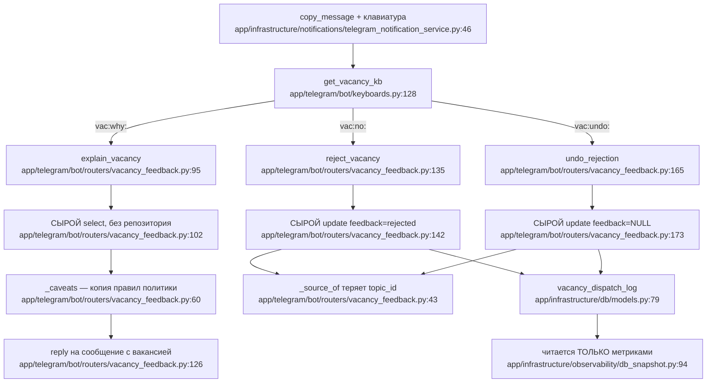
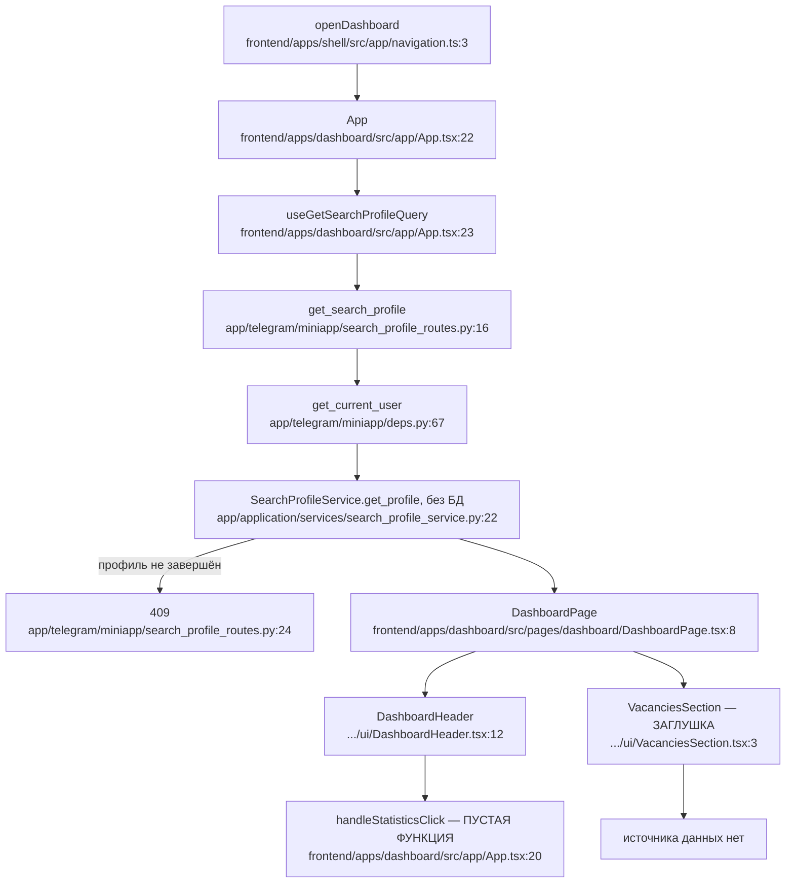

# F3 — Обратная связь по вакансии, F7 — Дашборд

## F3: единственное место в коде, обходящее слой репозиториев

Подтверждено: `vacancy_feedback.py` четырежды открывает
`async with async_session_factory()` напрямую — строки **45, 102, 142, 173** —
и сам вызывает `session.commit()` (`:149`, `:180`).

Это **единственный файл** во всём `app/telegram/bot/routers/`, который так
делает. Все соседи ходят через UoW, обычно за сервисом приложения:
`onboarding.py:30`, `profile.py:42`, `account.py:66`, `resume.py:167,224`,
`broadcast.py:35,70`, `developer.py:19`. Даже запись в **ту же таблицу** со
стороны рассылки идёт через UoW (`telegram_notification_service.py:75`).

Следствия: presentation-слой трогает ORM-модели напрямую, для записей нет
метода репозитория, нет сервиса приложения — значит нет шва для тестов, а
коммитом управляют вручную.

## F3: отметка «не подходит» ни на что не влияет

Колонка `feedback` **не читается ничем, кроме метрик**. Единственные читатели
по всему `app/` — `db_snapshot.py:96` и синхронизация метрик. Ни подбор, ни
рассылка её не смотрят.

То есть кнопка меняет цифру на дашборде, а не будущие результаты. Пользователь
при этом видит «Отмечено, учту».

## F3: два дефекта поменьше

`_caveats` (`vacancy_feedback.py:60-92`) **заново реализует** правило
«пустое поле не фильтрует» из `evaluate_match`. Две копии одного правила
разъедутся при первой же правке политики.

`_source_of` (`:53-57`) строит ссылку как `t.me/{канал}/{сообщение}` и
**не берёт `source_topic_id`**, тогда как доменное свойство
(`entities.py:60-68`) для форумов даёт трёхчастную ссылку. Значит для вакансий
из форумов кнопка «Источник» работает при рассылке и **ломается после любого
нажатия «не подходит» или отмены** — клавиатура пересобирается уже неправильно.

Ещё: `update` в `reject_vacancy` не проверяет число затронутых строк — чужая
пара `(вакансия, пользователь)` молча обновит ноль строк и отчитается успехом.

## F7: дашборд наполовину не подключён

**Кнопка «Статистика» — буквально пустая функция**:
`frontend/apps/dashboard/src/app/App.tsx:20` — `() => undefined`. Она
протянута до `DashboardHeader.tsx:61-95`, где нарисована полноценная кнопка с
`aria-label="Открыть статистику"`. Бэкенд статистики существует и подключён
для других потребителей (`deps.py:39-40`) — это неподключённый провод, а не
отсутствующая возможность.

**`VacanciesSection` — статичная заглушка**:
`VacanciesSection.tsx:3-37`, компонент без пропсов с двумя строками текста. Ни
хука, ни импорта из `../api`. При этом запрос «разосланные вакансии
пользователя» в репозитории уже есть (`vacancy_repository.py:112-115`).
Раздел пуст **у всех**, включая тех, кому разослали сотни вакансий.

**Второй копии дашборда в шелле нет** — она удалена. Осталась только
`design/DashboardPreview.tsx`, доступная лишь из отдельной точки входа для
дизайна и не достижимая из продакшен-путей.

**Метрик у дашборда нет вообще** — ни одного `observe_feature` во всём пути.
Сколько людей до него доходит, неизвестно.

## Схемы

## Пробелы

Не проверено, доходят ли до этого пути вакансии из форумов в реальности.
Тесты обеих фич не читались. Соответствие `_caveats` политике подтверждено
только по комментарию в коде, не построчно.
