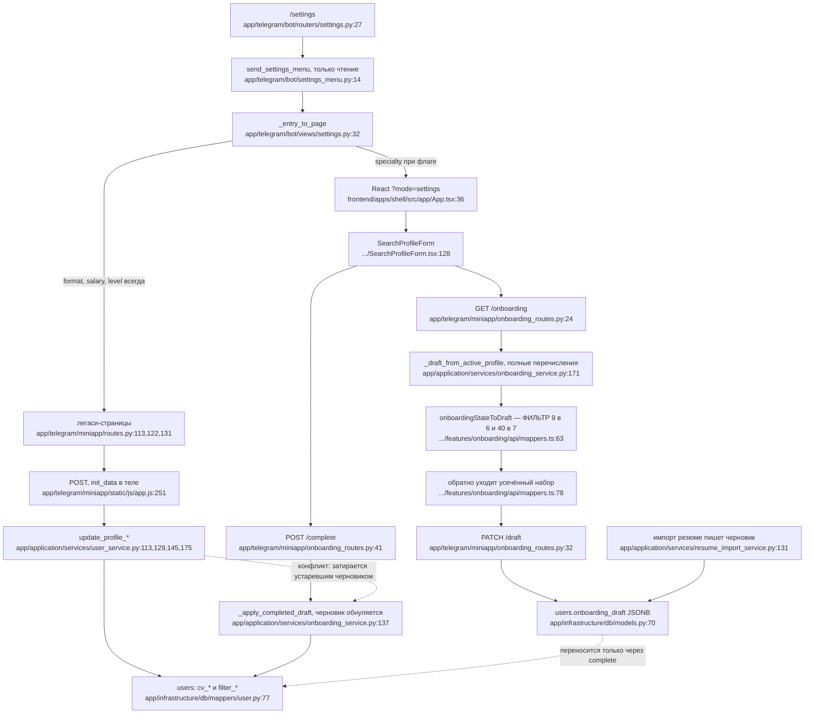

# F5 — Редактирование профиля поиска (три транспорта)

## Транспорт 1 — бот: ничего не пишет

`cmd_settings` (`settings.py:27`) и `open_settings_from_profile` (`:42`) только
читают через `UserService.get_user_by_tg_id` и рисуют меню. Ни один из трёх
обработчиков не пишет в `users`.

Но бот решает главное — **куда попадёт пользователь**, и раздаёт кнопки в
разные модели записи (`app/telegram/bot/views/settings.py:32-45`):

```
SETTINGS_ENTRY_SPECIALTY: "react/" если MINIAPP_REACT_ENABLED иначе "specialty"
SETTINGS_ENTRY_FORMAT:    "format"   ← всегда легаси
SETTINGS_ENTRY_SALARY:    "salary"   ← всегда легаси
SETTINGS_ENTRY_LEVEL:     "level"    ← всегда легаси
```

**При включённом флаге одно меню из четырёх кнопок отдаёт пользователю две
несовместимые модели записи одновременно.** Сейчас на проде флаг выключен,
поэтому проблема спит.

## Транспорт 2 — легаси: прямая запись в активный профиль

`save_specialty` (`routes.py:229`), `save_format` (`:267`), `save_salary`
(`:310`), `save_level` (`:357`) → `UserService.update_profile_*`
(`user_service.py:113,129,145,175`). Каждый берёт `get_by_tg_id_for_update`,
меняет поля и коммитит. **Немедленно, по одному полю, без черновика.**
`onboarding_draft` не трогает никогда.

Списки вариантов строятся из полных перечислений и защищены проверкой на
импорте (`page_context.py:219-241`).

## Транспорт 3 — React: черновик, перенос только на «завершить»

`GET /onboarding` → `get_state`; если черновика нет, он синтезируется из живого
профиля (`onboarding_service.py:171`). `PATCH /draft` пишет **только**
`onboarding_draft`. `POST /complete` → `_apply_completed_draft`
(`:137`) переносит в `cv_*` и обнуляет черновик.

`onboarding_draft` — JSONB-колонка **той же строки** `users`
(`models.py:70`). Обе модели пишут одну строку, разные колонки.

## Где транспорты расходятся

| Поле | Легаси | React |
|---|---|---|
| специализации и навыки | сразу, полные перечисления | через черновик, **урезанные клиентом** |
| формат работы | `set_legacy_work_format` — **один** | `set_work_formats` — **несколько** |
| зарплата | сразу | на `/complete` |
| режим грейда | любой из четырёх | только `EXACT`, либо `AT_LEAST` для `JUNIOR_PLUS` |
| опыт | пишется (`user_service.py:164-170`) | **не пишется никогда** |
| `Grade.LEAD` | выбирается | недостижим |

## Четыре сценария порчи данных

Все достижимы из **одного и того же меню бота**.

1. Легаси сохраняет `Mobile` и `Kotlin`. Пользователь открывает React-кнопку —
   значения приходят с сервера, но отбрасываются фильтром, следующий `PATCH`
   сохраняет усечённый набор, `/complete` затирает `cv_*`. **Тихая потеря.**
2. Незавершённый React-черновик + правка зарплаты через легаси → возврат в
   React и «завершить» **откатывает правку**.
3. React выставил два формата работы, легаси-кнопка формата схлопывает их в
   один. Вернуть множественность можно только заново пройдя React.
4. `/complete` жёстко ставит `filter_grade_mode = EXACT`. У пользователя,
   чей профиль собран из резюме (там `UP_TO`), фильтр молча сужается, а опыт
   остаётся замороженным — React его не трогает.

## Урезание списков подтверждено с точными числами

| | В React зашито | В домене | Разница |
|---|---|---|---|
| специализации | **6** (`SpecialtyStep.tsx:24-61`) | **9** (`value_objects.py:43-52`) | нет DS/ML, Mobile, GameDev |
| навыки | **7** (`SpecialtyStep.tsx:63-71`) | **40** (`value_objects.py:55-112`) | **33 недостижимы** |

Фильтрация — **жёсткий отброс, а не скрытие в интерфейсе**, в трёх точках:
`mappers.ts:66-67`, `SpecialtyStep.tsx:81-88`, `SearchProfileForm.tsx:54-55`.
Отфильтрованный массив уходит обратно на сервер через
`specialtyDraftRequest` (`mappers.ts:78-85`). Бэкенд принимает полные
перечисления на обоих транспортах — сужение целиком на стороне клиента, и оно
**уничтожает серверные данные на круговом обходе**.

## Два канала initData

| Запрос | Канал |
|---|---|
| легаси GET | заголовок `X-Telegram-Init-Data` (`app.js:305`) |
| легаси POST | **поле `init_data` в теле** (`app.js:257`) |
| React, всё | только заголовок (`createTelegramBaseQuery.ts:23-28`) |

Оба приходят в один `validate_init_data`. Легаси-канал означает, что
подписанные данные попадают в тела запросов и логи на записи, но в заголовки
на чтения.

## Схема



## Пробелы

Шаблоны Jinja не читались — фильтрация на уровне шаблона не проверена, хотя
проверка на импорте делает её маловероятной. Уровень изоляции транзакций при
одновременных легаси-POST и React-PATCH не подтверждён. Тесты
`mappers.test.ts` могут фиксировать урезание как ожидаемое поведение — не
проверено.
